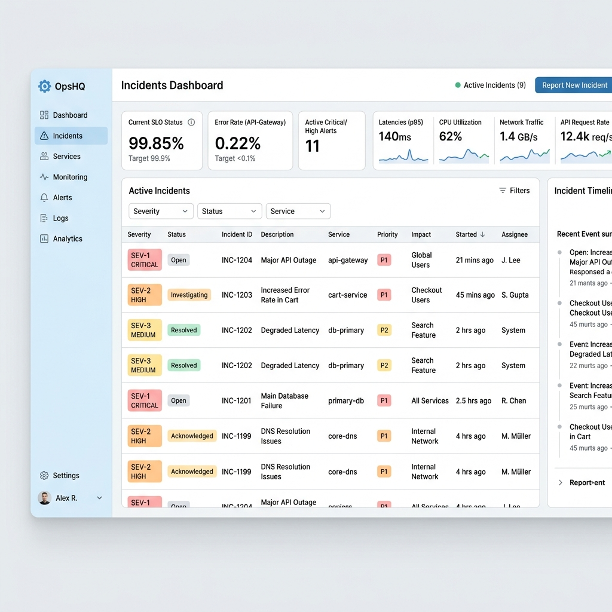
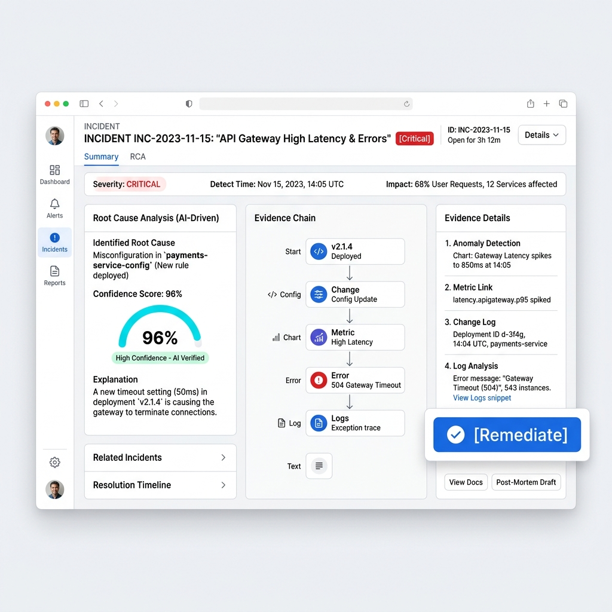

# AI Incident Root Cause Analyzer

A professional incident investigation console for SRE and DevOps teams. This project demonstrates a production-oriented implementation of an AI-driven Root Cause Analysis (RCA) pipeline.

The system automatically correlates logs, metrics, traces, and deployment signals. It runs a multi-agent RCA workflow to determine the root cause of an incident, presents explainable confidence scoring, and safely records idempotent remediation simulations with an audit trail.

---

## 📸 Screenshots

### 1. Incident Dashboard


*This screenshot shows the Main Dashboard view. The table lists active incidents, and minimal sparklines give immediate visibility into metrics.*

### 2. Root Cause Analysis (RCA)


*This view shows the AI-driven confidence scores and the evidence chain connecting logs and metrics. The **Remediate** button allows triggering an idempotent remediation sequence.*

---

## 🚀 Features

- **Multi-Agent Investigation Pipeline**: Distributes the workload across specialized AI agents.
- **RCA Confidence Factors**: AI decisions are backed by evidence and alternative hypotheses.
- **Idempotent Remediation**: Simulates safe remediation with full audit trails.
- **WebSocket Dashboard**: Live updates to incident tracking.
- **Docker-Ready**: Deployable via Docker and Docker Compose.
- **Professional Light UI**: A modern interface familiar to users of Grafana and Datadog.

## 🛠️ Deployment & Getting Started

### Prerequisites
- Python 3.10+
- Modern Web Browser
- Docker (optional, for containerized execution)

### Option 1: Run Locally

1. **Start the Backend Server**:
   ```powershell
   python backend\server.py
   ```
2. **Access the Application**:
   Open your browser and navigate to: [http://localhost:8000](http://localhost:8000)

3. **Run Verification Tests** (Optional):
   ```powershell
   python -m unittest discover -s tests -v
   ```
   *or using the script:*
   ```powershell
   .\scripts\verify.ps1
   ```

### Option 2: Docker Compose

1. **Build and Run the Containers**:
   ```powershell
   docker compose up --build
   ```
2. **Access the Application**:
   Navigate to: [http://localhost:8000](http://localhost:8000)

---

## 📡 API Surface

The backend exposes a well-defined API:

| Endpoint | Method | Purpose |
|---|---|---|
| `/api/health` | `GET` | Liveness check |
| `/api/ready` | `GET` | Readiness and storage check |
| `/api/metrics` | `GET` | Operational metrics |
| `/api/incidents` | `GET` | Incident dashboard snapshot |
| `/api/incidents/{id}` | `GET` | Single incident detail |
| `/api/incidents/{id}/investigate` | `POST` | Run the RCA pipeline |
| `/api/remediate` | `POST` | Record an idempotent remediation simulation |
| `/ws` | `WebSocket` | Live snapshot updates |

---

## 🏗️ Project Architecture

```text
backend/          # Python backend, API, and Agent logic
frontend/         # HTML/CSS/JS light operations UI
tests/            # Verification and test suites
scripts/          # Helpful utilities
```
